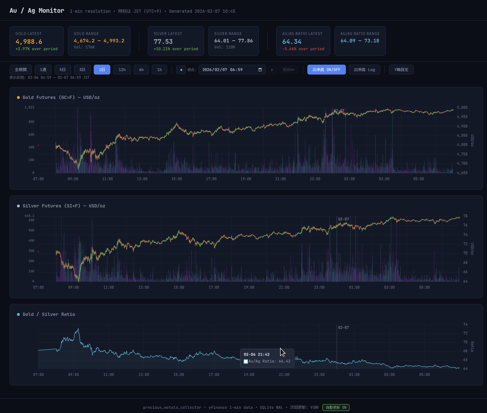

# Au/Ag Monitor

<div align="center">

**金・銀 1分足データ収集・可視化システム**

yfinance を利用して金先物 (GC=F) と銀先物 (SI=F) の1分足データを自動収集し、SQLite に蓄積・可視化するシステム。
インタラクティブなWebチャートでローソク足、金銀比率、出来高を分析できます。



</div>

##  特徴

-  **長期データ蓄積**: yfinance の7日制限を回避し、無制限に連続データを蓄積
-  **インタラクティブチャート**: Chart.js ベースのローソク足チャート（HTML生成）
-  **自動差分取得**: DB最新データから継続取得、重複排除で効率的に蓄積
-  **レスポンシブUI**: iPad Safari 等で快適に閲覧可能
-  **金銀比率分析**: リアルタイムで金銀比率を自動計算・表示
-  **欠損検出**: データギャップの自動検出と補完機能
-  **スペクトル分析**: HPF + FFT による高周波成分の可視化
- ️ **クロスプラットフォーム**: Python 3.8+ があれば Windows/macOS/Linux/Raspberry Pi で動作

## アーキテクチャ

```
┌─────────────┐     HTTP      ┌──────────────┐
│Yahoo Finance│ ◄────────────  │ collector.py │
│ (yfinance)  │ ────►JSON────► │   (Python)   │
└─────────────┘  直近7日の1分足  └──────┬───────┘
                                      │ UPSERT
                                      ▼
                            ┌──────────────────┐
                            │precious_metals.db│
                            │  (SQLite/WAL)    │
                            └────┬─────────┬───┘
                                 │         │
                 ┌───────────────┘         └───────────────┐
                 ▼                                         ▼
       ┌──────────────────┐                    ┌──────────────────┐
       │plot_timeseries.py│                    │  query_data.py   │
       │  インタラクティブ  │                    │   ・統計表示      │
       │  HTMLチャート生成  │                    │   ・CSVエクスポート│
       │  ・ローソク足      │                    │   ・欠損検出      │
       │  ・金銀比率       │                    │   ・スペクトル分析│
       │  ・出来高         │                    └──────────────────┘
       └──────────────────┘
```

## クイックスタート

### 1. 必要環境

- Python 3.8 以上
- インターネット接続（データ取得時）

### 2. インストール

```bash
# リポジトリクローン
git clone https://github.com/takaeda/auag-monitor.git
cd auag-monitor

# 【方法1】手動インストール（全OS対応）
pip install yfinance numpy pandas

# 【方法2】自動セットアップ（Linux / Raspberry Pi 専用）
# ※ cron を使用するため、Linux/Raspberry Pi のみ対応
# ※ macOS は cron 使用可能ですが、launchd 推奨（詳細は後述）
chmod +x setup.sh
./setup.sh
```

**Windows ユーザーへ**: setup.sh は Linux/Raspberry Pi 専用です。Windows では手動インストール後、「自動収集の設定 > Windows」セクションを参照してタスクスケジューラを設定してください。

### 3. データ収集

```bash
# 基本実行（金・銀、直近7日分）
python3 collector.py

# DB パス指定
python3 collector.py --db /path/to/metals.db

# 差分取得を無視して全期間取得
python3 collector.py --force-full
```

### 4. チャート生成

```bash
# 基本実行（全期間・全シンボル）
python3 plot_timeseries.py

# DB パス指定
python3 plot_timeseries.py --db /path/to/metals.db

# 出力先指定
python3 plot_timeseries.py -o custom_chart.html
```

生成された `chart.html` をブラウザで開くとインタラクティブチャートが表示されます。

### 5. データ確認・分析

```bash
# 蓄積状況の確認
python3 query_data.py stats

# CSV エクスポート
python3 query_data.py export --symbol GC=F
python3 query_data.py export --symbol GC=F --start 2026-01-20 --end 2026-01-25

# 欠損区間の検出
python3 query_data.py gaps --symbol GC=F

```

## 主要機能

### collector.py（データ収集）

#### 主要機能
- yfinance から GC=F（金先物）、SI=F（銀先物）の1分足OHLCV データを取得
- **差分取得の自動判定**: DB の最新タイムスタンプから継続取得（初回は全期間）
- **volume=0 検知**: 過去24時間以内のvolume=0データを自動再取得して補完
- **UPSERT 方式**: 重複データは無視、不完全データは後続取得で上書き
- **リトライ機能**: 取得失敗時は3回まで自動リトライ（30秒間隔）
- **収集ログ**: collection_log テーブルに成功/失敗を記録

#### データ蓄積の仕組み

yfinance の1分足は **直近7日間** しか取得できませんが、cron で定期実行することで連続データを蓄積できます。

```
1週目: |=======|                  ← 7日分取得
2週目:     |=======|             ← 重複部分は無視、新規分のみ追加
3週目:         |=======|         ← 同様に継続
         ↓
蓄積結果: |================|      ← 3週間の連続データ
```

差分取得時は DB の最新タイムスタンプから30分前（OVERLAP_MINUTES）まで遡って取得し、欠損を防ぎます。

### plot_timeseries.py（インタラクティブチャート生成）

#### 主要機能

**チャート表示**
- **ローソク足**: Open/High/Low/Close を色分け表示（上昇=緑、下落=赤）
- **金銀比率**: 金価格 ÷ 銀価格を自動計算してリアルタイム表示
- **出来高チャート**: 価格変動に応じて色分け（上昇時=シアン、下落時=マゼンタ）
- **統計カード**: 最新値、変動率、レンジ（高値/安値）、総出来高を表示

**インタラクティブ機能**
- **時間範囲選択**: 1h/6h/12h/1d/3d/5d/1w/全期間 のボタン切替
- **ナビゲーション**: 前後スクロール、最新へジャンプ、datetime-local 入力で任意時刻へ移動
- **Shift + ホイール**: 横スクロールでチャートを滑らかに移動
- **Y軸スケール設定**: 自動/手動切替、Gold/Silver/Ratio 個別に設定可能（UI/CLI両対応）
- **出来高表示切替**: ON/OFF、対数スケール切替
- **自動リロード**: 3分ごとに最新データを再読込（ON/OFF切替、状態保存）

**設定の永続化**
- **localStorage**: 表示設定（時間範囲、出来高表示、Y軸設定等）を保存
- **URLハッシュ**: リロード時の状態を一時保存（自動リロード機能で使用）

**その他**
- **リサンプル機能**: CLI で `--resample 5min` 等を指定すると5分足/15分足等に集約
- **レスポンシブデザイン**: iPad Safari 等のタブレット・スマホでも快適に閲覧
- **ダークモード UI**: JetBrains Mono フォント、洗練されたダークテーマ

#### 生成されるチャート

生成される `chart.html` は単一ファイルで完結し、以下を含みます：
- Chart.js（CDN）
- 全データを JSON 埋め込み
- カスタムプラグイン（ローソク足描画、日付ラベル）
- インタラクティブ機能の JavaScript

#### 自動更新の仕組み

生成された chart.html には自動リロード機能が組み込まれています：
- デフォルトで **3分（180秒）ごと** にページを再読み込み
- ON/OFF 切替ボタンで制御可能
- 状態（時間範囲、Y軸設定等）は localStorage と URLハッシュで保存

 **重要**: この自動リロードは「HTMLファイル自体」を再読み込みする機能です。

**最新のデータを反映するには、collector.py でデータ取得後、plot_timeseries.py を再実行して chart.html を上書きする必要があります。**

**最新データを自動反映する運用例**:
```bash
# crontab で30分ごとにデータ取得＋チャート更新（推奨）
*/30 * * * * cd /path/to/auag-monitor && python3 collector.py && python3 plot_timeseries.py
```

この設定により、chart.html をブラウザで開きっぱなしにしておけば、
1. cron で collector.py 実行（新データ取得）
2. plot_timeseries.py 実行（chart.html 更新）
3. ブラウザが3分後に自動リロード（更新されたHTMLを表示）

という流れで、最新データが自動的に表示されます。

### query_data.py（データ分析）

#### サブコマンド

**stats** - 蓄積状況の表示
```bash
python3 query_data.py stats
```
- 各シンボルの総行数、期間、平均行数/日
- 直近14日の日別行数（棒グラフ）
- 直近10件の収集ログ

**export** - CSV エクスポート
```bash
python3 query_data.py export --symbol GC=F
python3 query_data.py export --symbol GC=F --start 2026-01-20 --end 2026-01-25 -o gold_jan.csv
```
- 指定期間のOHLCVデータをCSV出力
- タイムスタンプはUTC（ISO 8601形式）

**gaps** - 欠損区間の検出
```bash
python3 query_data.py gaps --symbol GC=F
python3 query_data.py gaps --symbol GC=F --gap-min 10
```
- 指定閾値（デフォルト5分）以上のギャップを検出
- 週末（金曜夜→日曜夜）のギャップは自動判定して表示

**spectrum** - 簡易スペクトル分析
```bash
python3 query_data.py spectrum --symbol GC=F --date 2026-02-04
python3 query_data.py spectrum --symbol GC=F --date 2026-02-04 --window 60
```
- **HPF（ハイパスフィルタ）**: 移動平均でトレンド除去
- **FFT**: パワースペクトル計算（ハニング窓適用）
- **出来高規格化**: √volume で高周波成分を規格化
- **エンベロープ**: 30分窓ごとのボラティリティ（標準偏差）を表示

## データベーススキーマ

### ohlcv_1m（メインテーブル）

| カラム       | 型      | 説明                                  |
|-------------|---------|--------------------------------------|
| symbol      | TEXT    | ティッカー (GC=F, SI=F)               |
| ts          | TEXT    | ISO 8601 UTC タイムスタンプ            |
| open        | REAL    | 始値                                  |
| high        | REAL    | 高値                                  |
| low         | REAL    | 安値                                  |
| close       | REAL    | 終値                                  |
| volume      | INTEGER | 出来高                                |
| collected_at| TEXT    | データ取得日時（デバッグ用）            |

**PRIMARY KEY**: `(symbol, ts)`
**INDEX**: `idx_ohlcv_1m_ts` on `(symbol, ts)`

### collection_log（収集ログ）

取得の成功/失敗を記録。デバッグや欠損原因の追跡に使用。

| カラム         | 型      | 説明                      |
|---------------|---------|--------------------------|
| id            | INTEGER | PRIMARY KEY AUTOINCREMENT |
| symbol        | TEXT    | ティッカー                |
| started_at    | TEXT    | 取得開始時刻              |
| finished_at   | TEXT    | 取得終了時刻              |
| rows_fetched  | INTEGER | yfinance から取得した行数 |
| rows_inserted | INTEGER | DB に挿入した行数         |
| status        | TEXT    | success / error          |
| error_msg     | TEXT    | エラーメッセージ          |

##  自動収集の設定

### Linux / Raspberry Pi（cron）

**setup.sh による自動設定**:
```bash
# Linux/Raspberry Pi 専用（cron使用）
./setup.sh
```
setup.sh は以下を自動実行します：
- 依存パッケージのインストール
- 動作テスト
- cron 登録（6h/12h/24h から選択）

**手動で cron 設定する場合**:
```bash
# crontab 編集
crontab -e

# 30分ごと（推奨）
*/30 * * * * cd /path/to/auag-monitor && python3 collector.py && python3 plot_timeseries.py >> /dev/null 2>&1

# 1時間ごと
0 * * * * cd /path/to/auag-monitor && python3 collector.py && python3 plot_timeseries.py >> /dev/null 2>&1

# 6時間ごと（最小限）
0 */6 * * * cd /path/to/auag-monitor && python3 collector.py && python3 plot_timeseries.py >> /dev/null 2>&1
```

**推奨頻度**: 30分ごと（1日48回）が、リアルタイム性とサーバー負荷のバランスが最適です。
yfinanceの制約上、1分足データは直近7日間のみ取得可能なため、頻繁に更新してもAPI制限に抵触しにくく、データ欠損リスクも低減できます。

### macOS（cron / launchd）

macOS でも cron は使用可能ですが、最近は **launchd が推奨** されています。

**cron 使用（簡易）**:
上記 Linux と同様に crontab で設定可能

**launchd 使用（推奨）**:
`~/Library/LaunchAgents/com.user.auag-monitor.plist` を作成:
```xml
<?xml version="1.0" encoding="UTF-8"?>
<!DOCTYPE plist PUBLIC "-//Apple//DTD PLIST 1.0//EN" "http://www.apple.com/DTDs/PropertyList-1.0.dtd">
<plist version="1.0">
<dict>
    <key>Label</key>
    <string>com.user.auag-monitor</string>
    <key>ProgramArguments</key>
    <array>
        <string>/bin/bash</string>
        <string>-c</string>
        <string>cd /path/to/auag-monitor && /usr/local/bin/python3 collector.py && /usr/local/bin/python3 plot_timeseries.py</string>
    </array>
    <key>StartInterval</key>
    <integer>1800</integer> <!-- 30分 = 1800秒 -->
    <key>StandardOutPath</key>
    <string>/tmp/auag-monitor.log</string>
    <key>StandardErrorPath</key>
    <string>/tmp/auag-monitor.error.log</string>
</dict>
</plist>
```

読み込み:
```bash
launchctl load ~/Library/LaunchAgents/com.user.auag-monitor.plist

# 確認
launchctl list | grep precious_metals

# 停止
launchctl unload ~/Library/LaunchAgents/com.user.auag-monitor.plist
```

### Windows（タスクスケジューラ）

**バッチファイル作成（推奨）**:
`C:\path\to\auag-monitor\update_chart.bat` を作成:
```batch
@echo off
cd C:\path\to\auag-monitor
python collector.py
if %errorlevel% equ 0 python plot_timeseries.py
```

**タスクスケジューラ設定**:
1. タスクスケジューラを起動
2. 「基本タスクの作成」を選択
3. トリガー: 毎日、繰り返し間隔 **30分**
4. 操作: プログラムの開始
   - プログラム: `C:\path\to\auag-monitor\update_chart.bat`
   - 開始: `C:\path\to\auag-monitor`

## ディスク使用量の目安

- 金先物の1分足: 約 **1,400 行/日**（取引時間約23h × 60min）
- 金 + 銀: 約 **2,800 行/日**
- 1行あたり約 100 bytes → **1日 約 280 KB**
- **1年で約 100 MB**（Raspberry Pi の SD カードでも十分）

## トラブルシューティング

### データが取得できない

- ネットワーク接続を確認
- `collector.log` を確認（エラーメッセージが記録される）
- 市場休場日（米国祝日、週末）はデータが少ない
- yfinance のサービス障害の可能性（時間を空けて再試行）

### yfinance がブロックされた

- リクエスト頻度を下げる（cron 間隔を 12h に変更）
- IP が一時ブロックされた場合、数時間後に自動復旧
- 複数回連続で失敗する場合は、`--days` を小さくして実行

### DB が肥大化した

```bash
# SQLite の VACUUM で圧縮（未使用領域を解放）
sqlite3 precious_metals.db "VACUUM;"
```

### volume=0 が多い

- 市場クローズ時間帯や流動性が低い時間帯は volume=0 が正常
- collector.py は volume=0 を検知して24時間以内のデータを自動再取得
- 再取得後も volume=0 のままなら、その時間帯は実際に取引がなかった可能性

### チャートが表示されない

- ブラウザのコンソール（F12）でエラーを確認
- Chart.js の CDN が読み込めているか確認
- ローカルファイル（`file://`）で開いている場合、一部ブラウザで制限あり

**解決策**: 簡易HTTPサーバーで開く

```bash
# ローカルのみアクセス（localhost:8000）
python3 -m http.server 8000

# ネットワーク越しアクセス（例: iPad 等の他デバイスから）
python3 -m http.server -b 192.168.1.6 8080
# ↑ 192.168.1.6 は自分のPCのIPアドレスに置き換えてください

# ブラウザで開く
# - 同一PC: http://localhost:8000/chart.html
# - 他デバイス: http://192.168.1.6:8080/chart.html
```

## ライセンス

MIT License

